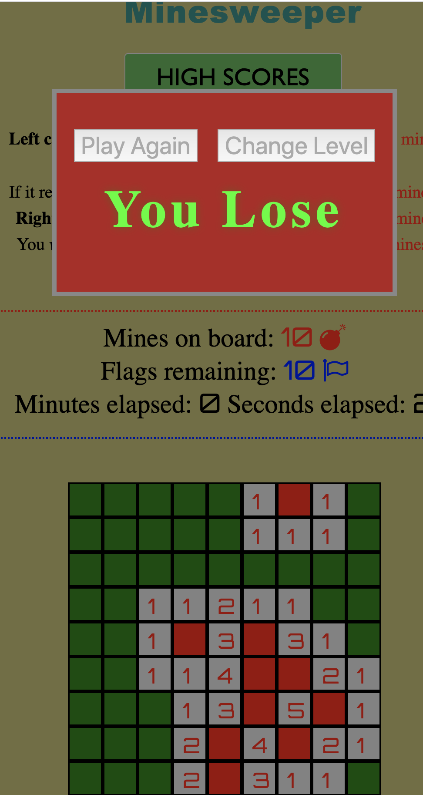

# Minesweeper

The classic game that you can play on Beginner, Intermediate, or Expert level. Built with JavaScript/HTML/CSS (no frameworks) on front end, with Express server and Postgres database to store high scores. Database setup was previously in Mongo, and the residual code is left intact so it can be switched over from Postgres if desired.

To play the game locally:

- run 'npm install' from the root directory
- run 'npm start' to launch the server/database (or 'npm server' if using Mongo instead of Postgres)
- navigate to localhost:3000

To play online, go to https://minesweeper-brian-price.herokuapp.com/.

